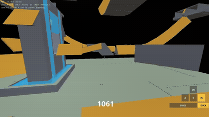
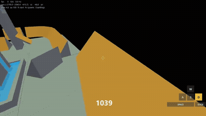
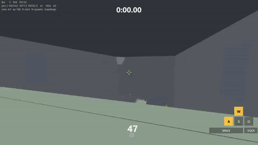

# RL_Surf

**An RL agent that learns to surf in Counter-Strike 1.6 — trained on
engine-exact physics, seeing the world through its own eyes.**

<table>
<tr>
<td width="50%">



</td>
<td width="50%">



</td>
</tr>
<tr>
<td align="center"><sub>Uncut 30-second rollouts, rendered through the real game client.
The keycaps show the agent's actual inputs — the camera is where it aims its
depth sensor. Full quality: <a href="media/agent_run1.mp4">run 1</a> ·
<a href="media/agent_run2.mp4">run 2</a></sub></td>
<td align="center"><sub>No scripted paths, no waypoints, no absolute position in the
observation — the agent navigates by a 128×64 depth camera and proprioception
alone, at sustained speeds beyond 1,600 u/s.</sub></td>
</tr>
</table>

## The race is won

<table>
<tr>
<td width="50%">



</td>
<td width="50%">

**surf_src_cannonball, beaten start-to-finish from scratch.** A
198,380-unit geodesic track guarded by four fail-net transfer jumps;
the agent races it in **1:19.73** (human world record: 1:08 — the next
target). Shown at 3× speed with the run clock — it starts as the agent
drops off the start cliff and freezes green at the finish curtain. Full
quality: [race_fastest_3x.mp4](media/race_fastest_3x.mp4).

The recipe was found in one night of ~40 measured ablations, and it is
exploration, not scale: γ 0.9995 plus count-based curiosity keyed on
**position × speed × gaze** (`--int-coef 0.25 --int-speed 3
--int-view 8`). From random weights to a stable finisher: ~5.4B env
steps ≈ 6,900 PPO iterations ≈ **2 hours on one RTX 5090**. The
12B-step brute-force control gained zero; RND, bigger networks, a
pinhole camera and frame stacking all screened neutral-to-negative.
The full evidence trail — every arm, curve and dead end — lives in
[docs/research-results.md](docs/research-results.md).

</td>
</tr>
</table>

## What this is

The GoldSrc/CS 1.6 movement engine (ReGameDLL_CS `pm_shared`, vanilla path) is
reimplemented as a standalone, vectorized C environment that collides against
real `.bsp` maps — so a policy trained here can later be deployed on a real
ReHLDS server with **no sim2real gap**. On top of it: a GPU-resident PPO
trainer with a triton-rendered depth-vision pipeline, a local W&B-style
dashboard, and a film kit (first-person depth videos, game-client replays,
3D trajectory viewer) for studying what the agent actually does.

The agent's rules are deliberately honest:

- **It sees, it doesn't memorize.** Observations are a 128×64 depth image
  (equiangular "lidar" it aims with its own view yaw/pitch) plus ego-frame
  proprioception — velocity, body flags, last actions. No absolute position,
  no compass: memorize-the-coordinates policies are structurally impossible.
- **Physics is the real thing.** Air-strafe acceleration (`sv_airaccelerate
  100`), the 0.7-normal surf threshold, ducking with the authentic duck-peek
  quirk, ladders, water (including the duck+jump skim), stamina, the bhop cap
  — transcribed function-by-function and verified against analytic tests
  (a ramp slide reproduces 196→584 u/s with zero input).
- **Falling is fatal.** Map teleports (the jail for fallers) end the episode,
  so speed must be kept on the ramps, not farmed in a cell.

## What's implemented

**Environment (C, `src/`)** — BSP v30 loader with clipnode hull tracing
(`PM_RecursiveHullCheck` port), full `pm_shared` movement transcription with
float32-parity discipline, map triggers (teleports, boosters, hurt), same-step
autoreset with terminal observations, spawn-pool curricula. ~13–15M env
steps/s eyeless on 32 threads.

**Vision (`python/surfgym/vision.py`)** — the map is voxelized once into a
signed-distance field (through the exact collision code, solid entities
included); a triton kernel then sphere-traces all 16.7M rays of a 2048-env
batch in ~6 ms with per-ray early exit. Full-map range with a
near-linear/far-compressed depth encoding; accuracy is median 8u vs exact
traces. The view pitch is a learned action (clamped [−70°, +30°] — an all-sky
view is a sensor-collapse attractor we met personally).

**Training (`python/train_fast.py`)** — GPU-resident PPO with fused
multi-head sampling, CUDA graphs, bf16, frame-skip (100Hz physics, 33Hz
decisions), and update-density matched to SB3 (verified by config-clone
bisection to reproduce SB3's learning curve exactly). Reward library:
forward-progress, path-length, curriculum blends, max-speed,
coverage-gated speed (fresh-map cells paid at entry speed — the "cinematic
tour" objective), and an acro layer (rate-capped air spins and switch
landings, paid only on survived ramp catches). Exploring starts: spawns
400–800u above every surfable face with randomized velocity/yaw/gaze.
Checkpoint configs are self-describing — a bare `--ckpt` resume restores the
run's reward, curriculum, sensor and architecture settings.

**Race objective (`--reward race`)** — pass a linear map (surf_src_cannonball,
a 198,380-unit geodesic track) start-to-finish in minimal time. The finish
line is read straight out of the BSP: timed maps wire a thin trigger brush
to their timer's stop button, and `surfgym/zones.py` extracts that brush's
AABB into an editable `maps/<map>.zones.json`. The C env sweeps each tick's
movement segment against the zone (a 1u curtain registers at any speed) and
completes the episode; fallers hit the map's own teleport-to-start = instant
fail; an env whose best distance-to-finish stalls for 15s is killed. Reward
is potential-based shaping on **geodesic** distance-to-finish — a one-time
GPU Bellman-Ford bake over the map's free voxels (thin-slab-aware occupancy,
sentinel walls, honest-corner trilinear sampling) — so loop-farming
telescopes to exactly zero and return = progress − time·cost: minimizing
time IS the objective. `--race-dist euclid` swaps in the zero-precompute
straight-line proxy (the A* heuristic) for many-map scaling, at the price of
negative shaping around hairpins.

**Tooling** — `tools/dashboard.py` is a local W&B-lite: live metric curves,
rollout artifacts with one-click 3D replay (per-episode reward reconstructed
from positions), record-at-latest-checkpoint buttons, and on-demand
first-person **POV videos** of exactly what the CNN sees, with a WASD/jump/
duck keycap overlay. The playable client (`python/play.py`) doubles as a
**replay renderer**: any recorded rollout can be watched or exported to mp4
through the real game view, with a surf-timer run clock that starts at the
opening cliff drop and freezes at the finish touch.

<details>
<summary>Engine verification gates (all green)</summary>

| Gate | Result |
|---|---|
| A — BSP v30 loader + entities | surf_ski_2: 3396 planes, 7379 clipnodes, 50 models, 10 teleports, 7 pushes, 18 spawns ✓ |
| B — hull tracing | all invariants ✓ (floor rest z 41.03, 381 ramp-normal hits) |
| C — physics port + analytic tests | 8/8 ✓ incl. real ramp slide 196→584 u/s, never grounded |
| D — vectorized env + benchmark | 1.42M steps/s single-thread, 8.4M steps/s on 32 threads |
| E — visualizer + map exporter | mesh + trajectory playback + waypoint editor ✓ |
| F — integration | Python binding 16/16; 9.2M steps/s from Python ✓ |

</details>

## Quickstart

```powershell
# Windows (VS2022); Linux: ./build.sh --test
.\build.ps1                                  # surfcore.dll + C test suites

python python\play.py                        # PLAY IT: first person, CS 1.6 feel,
                                             # real DLL physics at 100Hz

python python\train_fast.py --steps 1e9 --run myrun --reward coverage `
    --spawn mixed --ep-ticks 2000            # train (GPU vision, PPO)

python tools\dashboard.py                    # -> http://localhost:8000
                                             # curves, rollouts, 3D replay,
                                             # record buttons, POV videos
```

Studying a trained agent:

```powershell
python tools\record_ckpt.py runs\myrun\ckpt_latest.pt --stochastic   # record rollouts
python tools\render_pov.py  runs\myrun\traj_X.jsonl                  # depth-POV mp4
python python\play.py --replay runs\myrun\traj_X.jsonl --ep 1 `
    --dump out.mp4                                                   # game-client mp4
```

Human gameplay in the same physics (the baseline the agent is judged
against): [media/demo.gif](media/demo.gif) · [longer clip](media/demo.mp4).

## Training story (highlights)

- **Blind era**: scalar-only MLPs learned full-speed lane surfing (~1,140 u/s
  sustained average) — by memorizing coordinates, one groove per run, with
  alien-but-optimal conventions like surfing sideways (air-strafe physics
  only cares about wishdir-vs-velocity angle).
- **Trainer lessons, paid for in compute**: update density beats raw steps/s;
  the logged return must exclude the truncation bootstrap; a high entropy
  coefficient makes the greedy argmax drift weak while the stochastic policy
  improves — record stochastic rollouts to see what the curve measures.
- **Eyes**: first sighted runs discovered *sensor collapse* — surfing while
  staring at featureless sky (constant input ⇒ zero gradient on where to
  look). Fixed with the asymmetric view clamp; later diagnosed that with
  absolute position in the obs, vision was *optional* — hence no-GPS mode.
- **Reward economics**: every objective was gamed before it was right —
  jail-circling under path rewards (→ teleports end episodes), altitude
  farming under 3D coverage (→ 512u voxels + revisit penalty; penalty 10
  taught suicide, 1 is the sweet spot), all-or-nothing spin bonuses paid
  exactly zero times in a billion steps (→ dense rotation shaping, and
  measured spin rates 70× within hours).

## Roadmap

1. **Beat the human world record** — 1:08.0 stands against our 1:19.73:
   time-focused reward retune, self-imitation on the fastest lines, and
   the capacity/surf-mask combos the completion campaign never needed.
2. **1-hour scratch convergence** (from ~2.5h): kill the seed-variance
   tail (the "25k shelf" trap), screen at 32×16, finalize at 64×32.
3. **Generalist racer** — multi-map race training on the euclid proxy, then
   zero-shot evaluation on unseen linear maps.
4. **ReHLDS parity harness + Metamod fake-client deployment** (docs/05, 06).

(Formerly here: intrinsic novelty and frame stacking — both built and
measured. RND screened null at two doses; sharp count-based curiosity with
speed/gaze keys is what actually broke the walls. Frame stacking screened
negative — velocity is already in the scalars.)

## Layout

```
src/        C core: bsp.c trace.c pm.c env.c, surfcore.h (the ABI)
python/     surfgym package (ctypes, vec env, rewards, vision, recorder,
            zones + geodesic goal fields) + train_fast.py (GPU PPO)
            + play.py (client & replay renderer)
tools/      dashboard.py, record_ckpt.py, render_pov.py, export_map.py
viewer/     three.js trajectory player + waypoint editor (vendored three r147)
maps/       surf_ski_2.bsp, surf_src_cannonball.bsp + zones + cached fields
tests/      C test suites; python/tests binding suite
docs/       design docs + sourced physics research
```

## License

This repository's code is **GPLv3** (matching the ReHLDS/ReGameDLL_CS lineage
the physics port derives from). Engine reference sources are fetched from
their public upstream repos rather than redistributed; full provenance in
[NOTICE.md](NOTICE.md). Non-commercial project, not affiliated with Valve.

The bundled maps (`surf_ski_2`, `surf_src_cannonball`) are community-made
content and **all rights remain with their creators** — they are included
purely as research benchmarks, the way a dataset is to a vision paper.
Authors: if you want credit by name or removal, open an issue —
see [NOTICE.md](NOTICE.md).
