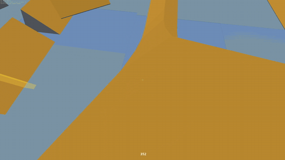

# RL_Surf



*Human gameplay in the playable client (`python/play.py`) — the real `surfcore.dll`
physics at 100 Hz on surf_ski_2, 2000+ u/s lines. [Longer clip](media/demo.mp4).*

Train an RL agent to surf in CS 1.6. The GoldSrc/CS 1.6 movement physics
(ReGameDLL_CS `pm_shared`, vanilla path) is reimplemented as a standalone,
vectorized C environment that collides against real `.bsp` maps — so a policy
trained here can later be deployed on a real ReHLDS server with no sim2real gap.
Full design in [`docs/`](docs/00-overview.md).

## Status — env built, all gates green

| Gate | Result |
|---|---|
| A — BSP v30 loader + entities | surf_ski_2: 3396 planes, 7379 clipnodes, 50 models, 10 teleports, 7 pushes, 18 spawns ✓ |
| B — hull tracing (`PM_RecursiveHullCheck` port) | all invariants ✓ (floor rest z 41.03, 381 ramp-normal hits) |
| C — physics port + analytic tests | 8/8 ✓ incl. **real ramp slide: 196→584 u/s, never grounded** |
| D — vectorized env + benchmark | **1.42 M steps/s single-thread, 8.4 M steps/s on 32 threads** (256 envs, random actions, zero NaN) |
| E — visualizer (three.js) + map exporter | mesh + trajectory playback + waypoint editor ✓ |
| F — integration | Python binding 16/16 tests; 9.2 M steps/s at 1024 envs from Python; recorded surf demo `runs/ramp_slide.traj.jsonl` (597.9 u/s) ✓ |

## Quickstart

```powershell
.\build.ps1                                  # MSVC: surfcore.dll + tests (needs VS2022)
.\build\test_trace.exe   maps\surf_ski_2.bsp # trace invariants
.\build\test_physics.exe maps\surf_ski_2.bsp # analytic physics tests
.\build\bench.exe        maps\surf_ski_2.bsp 256 2000

python python\benchmark.py                   # throughput through the ctypes binding
python python\demo_ramp.py                   # record a surf slide -> runs/ramp_slide.traj.jsonl
python python\demo_strafer.py                # scripted strafe bot, 256 envs

python python\play.py                        # PLAY IT: first-person, CS 1.6 bindings,
                                             # real DLL physics at 100Hz (see --help)

# viewer: serve and open http://localhost:8000  (auto-loads the map mesh;
# drag any runs/*.traj.jsonl in; press E for the waypoint editor)
cd viewer; python -m http.server
```

Regenerate the viewer mesh for another map: `python tools\export_map.py maps\<map>.bsp`.

## Layout

```
src/        C core: bsp.c trace.c pm.c env.c, surfcore.h (the ABI)
python/     surfgym package (ctypes, VecEnv/gym adapters, policies, recorder) + demos
tools/      export_map.py (bsp -> viewer mesh), make_sample_traj.py
viewer/     three.js trajectory player + waypoint editor (vendored three r147)
maps/       surf_ski_2.bsp + entity dump (+ your <map>.waypoints.json)
tests/      C test suites (Gates A-D)
docs/       design docs (00-06) + docs/research/ (sourced research)
third_party/ vendored reference sources (ReGameDLL_CS, HLSDK, ReHLDS) — read-only
```

## Next steps

1. **Author the real track spline**: open the viewer, press `E`, click waypoints
   down one surf lane, export to `maps/surf_ski_2.waypoints.json`.
2. `pip install stable-baselines3` (or use CleanRL) and train PPO against
   `surfgym.SurfVecEnv` with `spawn_mode=1` curriculum.
3. **Ducking** (PM_Duck/PM_UnDuck port — crouch tunnels, duck-jumps; the
   `enable_duck` flag and duck hull are already plumbed, the state machine isn't).
4. Later: ReHLDS replay parity harness and the Metamod fake-client deployment
   plugin (docs/05, docs/06 backlog).

Physics config is the CS 1.6 surf convention (`sv_airaccelerate 100`, gravity 800,
knife 250, 100 fps ticks) — every constant sourced in
[docs/01-physics-spec.md](docs/01-physics-spec.md).
