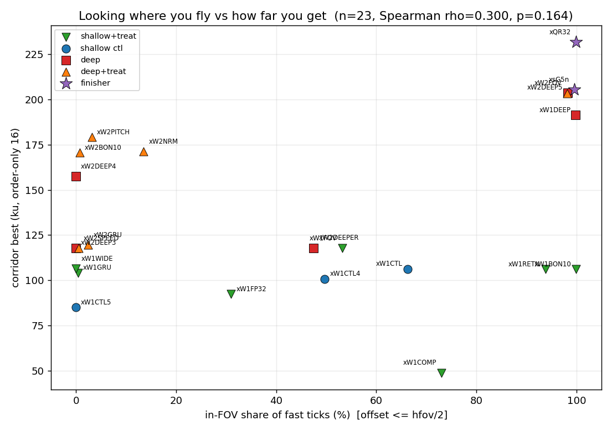
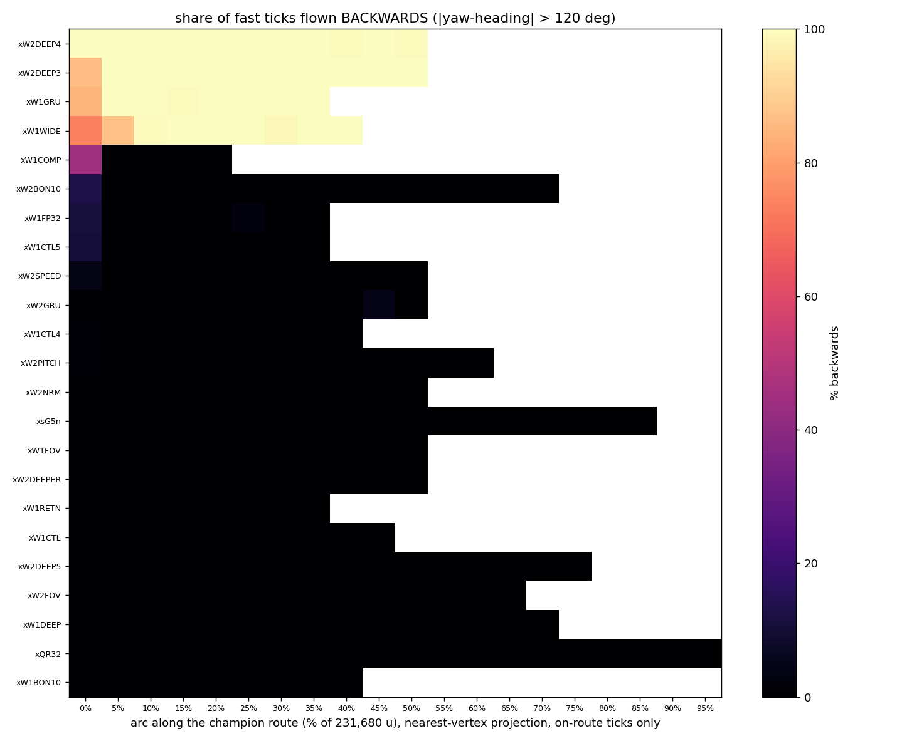

# Round 30 gaze audit: does the policy look where it flies?

Generated by `tools/gaze_wave.py` (CPU only, pure geometry over the
recorded trajectories). Definitions are `tools/gaze_stats.py`'s:

* fast tick = horizontal speed > 200 u/s (72830 ticks below that are
  excluded from every angle number; heading is noise there).
* offset = |wrap180(yaw - atan2(vy, vx))|; 0 = looking along the
  flight path, 180 = flying backwards.
* forward < 60 deg, sideways 60-120 deg, backwards > 120 deg.
* in-FOV = offset <= hfov/2, hfov taken from each run's own run.json
  (120 deg standard, 160 deg on the FOV arms).
* pitch = the raw pitch column over ALL ticks, no speed gate.
* corridor best = MAX of the order-only-16 corridor progress over the
  whole run's evals, from the harvested `corridor.csv`.

Evals used: the last 2 per run (9 greedy episodes each).

## 0. Answers

**1. Does the deep net fly backwards more than the shallow control?** Not
as a depth effect - as a CAPACITY effect, and it is a lottery, not a trend.
The 4 arms in the backwards branch are xW2DEEP4 (99.9%), xW2DEEP3 (96.4%), xW1GRU (95.5%), xW1WIDE (89.5%).
All 4 added capacity over the control (2 deep, 1 wide, 1 GRU); none of the
3 plain controls did (backwards 0.0%, 0.4%, 3.0%). But the deep arms do not do it
consistently: four runs of the SAME deep config (xW1DEEP, xW2DEEP3, xW2DEEP4,
xW2DEEP5) score 0.0%, 96.4%, 99.9%, 0.0% backwards - two of four
identical runs are blind and two are not. That is the seed lottery CLAUDE.md
already records for the corridor metric, read out on a new axis. The owner's
reading of the xW2DEEP4 recording is exactly right for that run (99.9% of its
fast ticks backwards, in-FOV 0.0%, and it still reaches 157,515 u of
corridor) - it just is not a property of depth.

**2. Do the pitch-fixed, normals and FOV arms look forward more?**
Pitch-fixing works on the axis it controls and nothing else; normals do not;
wide FOV is the only treatment that helps horizontally, and mostly arithmetically.

* xW2PITCH (`--pitch-fixed -25`): pitch median -25.0, 0.0% below -45 and 0.0%
  above +15 by construction, against 59-88% above +15 for the free-pitch
  deep arms. Horizontally unchanged: median offset 90.0, in-FOV 3.1% - it
  sits in the 90 deg branch.
* xW2NRM (normals): median offset 89.7, in-FOV 13.5% - the 90 deg
  branch too. No effect on gaze.
* xW1FOV / xW2FOV (hfov 120 -> 160): in-FOV 53.2% and 98.1%. xW1FOV's gain
  is arithmetic - the same offsets counted against a wider window (45.8% inside
  +/-60 deg vs 53.2% inside +/-80 deg). Only xW2FOV actually sits in the
  aligned branch (median offset 0.7).

What every free-pitch arm shares: the camera drifts to the +30 deg clamp and
stays (31-72% of ticks pinned at it across the 19 arms whose median pitch
is positive). surfcore.h: pitch aims the lidar and nothing else, so drifting
to the clamp is free unless the picture is being used.

**3. Do the finishers look forward?** Yes, and they are the cleanest cases in
the set. xQR32: median offset 0.6 deg, in-FOV 99.9%, 0.0% backwards, pitch
median -24.6 with 1.3% of ticks above +15 - it looks DOWN at the ramp.
xsG5n: median offset 0.7, in-FOV 99.6%, pitch median 16.1. Every arm that
reaches 190k+ u of corridor is in the aligned branch.

**4. Does in-FOV share correlate with corridor progress?** Weakly overall,
strongly inside the deep arms. Spearman rho(in-FOV, corridor best) = +0.300
(p = 0.164) over all 23 runs, +0.127 (p = 0.584) over the 21 wave arms alone, and
+0.743 (p = 0.009) over the 11 deep-net arms. As a two-group test on the wave
arms, the 5 aligned arms median 191,285 u against 118,736 u for the 10 blind arms
(Mann-Whitney U = 34.0, p = 0.310). The direction is consistent and the ceiling
is one-sided - the three best wave arms (xW2DEEP5, xW2FOV, xW1DEEP) are all aligned - but looking
forward is plainly not sufficient: xW1RETN and xW1BON10 look forward 94% and
100% of the time and still stop at ~106k u.

**5. Where along the route does the backwards flying happen?** Everywhere, and
it is a property of the RUN, not of the place. Splitting the per-(run, arc-bin)
backwards share additively, RUN identity explains 99.1% of the sum of squares
and PLACE explains 2.9%; for the broader out-of-FOV share the split is
90.8% / 9.1%. Each of the four backwards arms is backwards in EVERY arc bin
it reaches (11/11, 11/11, 8/8, 9/9 bins above 50%, per-run std 0.3-8.6 points);
every other run is at ~0% in every bin. No stretch of cannonball turns the
camera around - the policy picks a gaze mode at the spawn and holds it for the
whole flight, which is the shape of an open-loop habit rather than a reaction
to geometry.

## 1. Per-run gaze

| run | group | hfov | eps | fast ticks | med off | off p10-p90 | back >120 | side 60-120 | fwd <60 | in-FOV | pitch med | p<-45 | p>+15 | p at +30 | corr best |
|-----------|---------------|------|-----|------------|---------|-------------|-----------|-------------|---------|--------|-----------|-------|-------|----------|-----------|
| xW2DEEP3 | deep | 120 | 18 | 49889 | 179.2 | 173-180 | 96.4% | 3.6% | 0.0% | 0.0% | 30.0 | 0.5% | 88.5% | 63.1% | 117,830 |
| xW1WIDE | shallow+treat | 120 | 18 | 40303 | 179.2 | 117-180 | 89.5% | 10.5% | 0.1% | 0.1% | 30.0 | 0.0% | 84.9% | 69.6% | 106,361 |
| xW2DEEP4 | deep | 120 | 18 | 43916 | 179.0 | 134-180 | 99.9% | 0.1% | 0.0% | 0.0% | 30.0 | 0.0% | 86.4% | 56.8% | 157,515 |
| xW1GRU | shallow+treat | 120 | 18 | 39697 | 177.7 | 136-180 | 95.5% | 4.1% | 0.4% | 0.4% | 30.0 | 0.3% | 84.8% | 72.3% | 104,101 |
| xW1CTL5 | shallow ctl | 120 | 18 | 45087 | 90.6 | 89-93 | 3.0% | 97.0% | 0.0% | 0.0% | 23.6 | 0.1% | 60.6% | 42.2% | 84,973 |
| xW2BON10 | deep+treat | 120 | 18 | 37538 | 90.3 | 89-93 | 4.7% | 94.6% | 0.8% | 0.8% | 30.0 | 0.0% | 86.9% | 55.5% | 170,612 |
| xW2PITCH | deep+treat | 120 | 18 | 64384 | 90.0 | 88-91 | 0.2% | 96.6% | 3.1% | 3.1% | -25.0 | 0.0% | 0.0% | 0.0% | 179,232 |
| xW2SPEED | deep+treat | 120 | 18 | 43127 | 89.8 | 88-92 | 1.2% | 98.3% | 0.5% | 0.5% | 30.0 | 0.8% | 81.8% | 61.0% | 117,692 |
| xW2NRM | deep+treat | 120 | 18 | 29887 | 89.7 | 26-91 | 0.2% | 86.3% | 13.5% | 13.5% | 29.2 | 0.0% | 80.7% | 47.3% | 171,138 |
| xW2GRU | deep+treat | 120 | 18 | 60964 | 89.5 | 87-91 | 0.4% | 97.1% | 2.5% | 2.5% | 22.0 | 4.0% | 59.2% | 34.4% | 119,643 |
| xW1FP32 | shallow+treat | 120 | 18 | 47945 | 89.2 | 46-91 | 3.0% | 66.0% | 31.0% | 31.0% | 30.0 | 0.0% | 88.0% | 68.3% | 92,437 |
| xW1FOV | shallow+treat | 160 | 18 | 60460 | 72.2 | 45-89 | 0.0% | 54.1% | 45.8% | 53.2% | 16.7 | 0.0% | 51.8% | 33.3% | 117,744 |
| xW2DEEPER | deep | 120 | 18 | 57803 | 69.4 | 0-89 | 0.0% | 52.5% | 47.5% | 47.5% | 30.0 | 1.7% | 81.3% | 50.6% | 117,915 |
| xW1CTL4 | shallow ctl | 120 | 18 | 52311 | 61.1 | 44-91 | 0.4% | 49.9% | 49.7% | 49.7% | 30.0 | 0.0% | 78.0% | 53.0% | 100,781 |
| xW1COMP | shallow+treat | 120 | 18 | 29017 | 41.1 | 1-136 | 19.3% | 7.6% | 73.0% | 73.0% | -50.9 | 54.8% | 1.5% | 0.0% | 48,842 |
| xW1CTL | shallow ctl | 120 | 18 | 50997 | 26.4 | 1-89 | 0.0% | 33.7% | 66.3% | 66.3% | 28.1 | 0.0% | 67.2% | 45.8% | 106,271 |
| xW1RETN | shallow+treat | 120 | 18 | 51250 | 1.0 | 0-35 | 0.0% | 6.2% | 93.8% | 93.8% | 28.3 | 0.0% | 82.3% | 37.4% | 106,163 |
| xW1BON10 | shallow+treat | 120 | 18 | 24295 | 0.9 | 1-45 | 0.0% | 0.1% | 99.9% | 99.9% | 30.0 | 0.0% | 70.9% | 56.8% | 106,094 |
| xW1DEEP | deep | 120 | 18 | 45432 | 0.8 | 0-5 | 0.0% | 0.2% | 99.8% | 99.8% | 21.5 | 0.0% | 63.1% | 31.1% | 191,285 |
| xsG5n | finisher | 120 | 9 | 34693 | 0.7 | 0-9 | 0.1% | 0.4% | 99.6% | 99.6% | 16.1 | 4.1% | 55.0% | 26.1% | 205,428* |
| xW2FOV | deep+treat | 160 | 18 | 58365 | 0.7 | 0-5 | 0.0% | 5.2% | 94.8% | 98.1% | 21.0 | 1.1% | 59.4% | 31.7% | 203,485 |
| xW2DEEP5 | deep | 120 | 18 | 83743 | 0.7 | 0-3 | 0.0% | 1.7% | 98.3% | 98.3% | 28.4 | 0.0% | 75.8% | 45.0% | 203,753 |
| xQR32 | finisher | 120 | 9 | 69979 | 0.6 | 0-2 | 0.0% | 0.1% | 99.9% | 99.9% | -24.6 | 16.8% | 1.3% | 0.0% | 231,680* |

`*` = no corridor.csv harvested; scored from the supplied eval(s) only
with the same order-only-16 rule, so it is a floor, not the run best.

### 1b. The three attractors, and why 180 deg is free

`offset` is not spread over [0, 180]: every run LOCKS onto one of
three values and holds it to a few degrees (the p10-p90 column). The
three values are the three air-strafe equilibria, and which one a run
sits in is decided by which movement key it holds
(`src/surfcore.h`: a[2]/a[3] -> forwardmove/sidemove = {-400, 0, +400}):

* **offset ~0** - pure side-strafe (`forwardmove == 0`), wishdir
  perpendicular to the view, so the equilibrium velocity runs ALONG
  the view axis. The ramp being ridden is centred in the depth image.
* **offset ~90** - pure forward/back (`sidemove == 0`), wishdir along
  the view axis, so the equilibrium velocity is PERPENDICULAR to it.
  The camera points at the wall beside the flight path.
* **offset ~180** - pure side-strafe again, but with the camera
  turned around. **This is an exact symmetry of the physics**: with
  `forwardmove == 0`, wishdir = right * sidemove, and yaw += 180 flips
  the right vector, so negating `sidemove` reproduces the identical
  wishdir and the identical trajectory. Nothing in the movement code
  distinguishes the two branches. The ONLY thing that does is the
  depth image, which is rendered at `yaw` (`raster.py::render`).

So a policy that had learned 'see ramp => surf' could not sit in the
180 branch - the ramp would be off-screen. A policy that has memorised
this map is free to, and 4 of the 21 wave arms do.

| run | med off | side-only (fmove=0) | fwd-only (smove=0) | both | neither |
|-----------|---------|---------------------|--------------------|-------|---------|
| xW2DEEP3 | 179.2 | 85.9% | 2.6% | 5.4% | 6.2% |
| xW1WIDE | 179.2 | 70.2% | 9.8% | 18.2% | 1.7% |
| xW2DEEP4 | 179.0 | 71.2% | 3.9% | 24.4% | 0.5% |
| xW1GRU | 177.7 | 54.7% | 4.4% | 40.5% | 0.4% |
| xW1CTL5 | 90.6 | 1.9% | 93.5% | 4.2% | 0.4% |
| xW2BON10 | 90.3 | 1.4% | 87.6% | 9.0% | 1.9% |
| xW2PITCH | 90.0 | 2.7% | 87.5% | 3.5% | 6.3% |
| xW2SPEED | 89.8 | 2.7% | 87.9% | 8.2% | 1.1% |
| xW2NRM | 89.7 | 5.4% | 84.0% | 10.1% | 0.5% |
| xW2GRU | 89.5 | 2.9% | 89.5% | 6.2% | 1.5% |
| xW1FP32 | 89.2 | 4.2% | 59.5% | 35.4% | 0.8% |
| xW1FOV | 72.2 | 5.3% | 44.7% | 49.8% | 0.2% |
| xW2DEEPER | 69.4 | 41.6% | 49.6% | 8.3% | 0.5% |
| xW1CTL4 | 61.1 | 2.3% | 52.0% | 45.2% | 0.5% |
| xW1COMP | 41.1 | 39.0% | 8.5% | 49.0% | 3.4% |
| xW1CTL | 26.4 | 54.7% | 32.6% | 11.2% | 1.5% |
| xW1RETN | 1.0 | 71.4% | 11.6% | 10.9% | 6.1% |
| xW1BON10 | 0.9 | 71.5% | 0.9% | 25.7% | 1.9% |
| xW1DEEP | 0.8 | 87.7% | 0.9% | 10.3% | 1.1% |
| xsG5n | 0.7 | 82.7% | 4.0% | 6.5% | 6.9% |
| xW2FOV | 0.7 | 88.0% | 2.9% | 6.8% | 2.3% |
| xW2DEEP5 | 0.7 | 80.7% | 5.7% | 10.2% | 3.4% |
| xQR32 | 0.6 | 83.3% | 4.7% | 7.5% | 4.4% |

Pitch is even cheaper to get wrong: surfcore.h says outright that
*'pitch aims the lidar only - it has no effect on movement physics'*,
so a policy that does not use the picture pays nothing for letting the
camera drift to the +30 deg clamp. The `p at +30` column is that drift.

## 2. Treatments

| run | config diff vs xW1CTL |
|--------------|----------------------------------------------------------------------------------------------------------------|
| xW1BON10 | success_bonus 50->10 |
| xW1COMP | obs_compass 0->1 |
| xW1CTL | control (identical to ref) |
| xW1CTL4 | control (identical to ref) |
| xW1CTL5 | control (identical to ref) |
| xW1DEEP | tower_depth 2->4; conv_mult 1->2 |
| xW1FOV | lidar_hfov 120->160; lidar_vfov 90->120 |
| xW1FP32 | fp32_heads 0->1 |
| xW1GRU | rnn none->gru; rnn_size -->256 |
| xW1RETN | ret_norm 0->1 |
| xW1WIDE | emb 512->1024; hidden 448->896 |
| xW2BON10 | tower_depth 2->4; conv_mult 1->2; success_bonus 50->10 |
| xW2DEEP3 | tower_depth 2->4; conv_mult 1->2 |
| xW2DEEP4 | tower_depth 2->4; conv_mult 1->2 |
| xW2DEEP5 | tower_depth 2->4; conv_mult 1->2 |
| xW2DEEPER | tower_depth 2->6; conv_mult 1->3 |
| xW2FOV | lidar_hfov 120->160; lidar_vfov 90->120; tower_depth 2->4; conv_mult 1->2 |
| xW2GRU | rnn none->gru; rnn_size -->256; tower_depth 2->4; conv_mult 1->2 |
| xW2NRM | normals 0->1; tower_depth 2->4; conv_mult 1->2 |
| xW2PITCH | pitch_fixed -->-25; tower_depth 2->4; conv_mult 1->2; pitch_rate 1.33->0 |
| xW2SPEED | tower_depth 2->4; conv_mult 1->2; speed_coef 0->0.005 |
| xQR32 | route_points 8->-; route_span 6->-; route_critic_only 0->-; act_every 4->3; time_pen 0->0.01; finish_k 1->0; f |
| xsG5n | control (identical to ref) |

## 3. Group means

| group | n | med off | backwards | in-FOV | pitch med | corr best |
|----------------|-----|----------|------------|----------|------------|------------|
| deep | 5 | 85.8 | 39.3% | 49.1% | 28.0 | 157,660 |
| deep+treat | 6 | 75.0 | 1.1% | 19.8% | 17.9 | 160,300 |
| finisher | 2 | 0.7 | 0.0% | 99.7% | -4.3 | 218,554 |
| shallow ctl | 3 | 59.4 | 1.1% | 38.7% | 27.3 | 97,342 |
| shallow+treat | 7 | 80.2 | 29.6% | 50.2% | 16.3 | 97,392 |

## 4. in-FOV share vs corridor best (Spearman)

| subset | n | rho(inFOV, best) | p | rho(-backwards, best) | p |
|------------------------------|-----|------------------|--------|-----------------------|--------|
| all runs | 23 | +0.300 | 0.164 | +0.437 | 0.037 |
| wave arms only (xW1*/xW2*) | 21 | +0.127 | 0.584 | +0.367 | 0.101 |
| deep-net arms only | 11 | +0.743 | 0.009 | +0.697 | 0.017 |
| wave arms + xQR32 | 22 | +0.223 | 0.320 | +0.439 | 0.041 |

Spearman on a variable that takes three values is weak by
construction, so the same question asked as a two-group comparison,
wave arms only (the finishers are a different generation and their
corridor figure is a floor from one eval):

* looking forward (in-FOV >= 90 pct), n=5: corridor best median 191,285, mean 162,156
  (xW1BON10, xW1DEEP, xW1RETN, xW2DEEP5, xW2FOV)
* blind (in-FOV <= 15 pct), n=10: corridor best median 118,736, mean 132,910
  (xW1CTL5, xW1GRU, xW1WIDE, xW2BON10, xW2DEEP3, xW2DEEP4, xW2GRU, xW2NRM, xW2PITCH, xW2SPEED)
* Mann-Whitney U = 34.0, two-sided p = 0.310

## 5. Where along the route the backwards flying happens

Nearest-vertex projection onto the champion route; only ticks within
1500 u of the line (off-route falls project to arbitrary vertices).
Bins of 11584 u (5.0% of the 231,680 u route). Cells with fewer than 200
on-route fast ticks are blank.

| arc bin | % of route | runs scored | pooled backwards | runs > 50% | min | max |
|-----------|------------|-------------|------------------|------------|------|--------|
| 0-12 k | 0-5% | 23 | 19.7% | 4 | 0.0% | 99.8% |
| 12-23 k | 5-10% | 23 | 18.1% | 4 | 0.0% | 100.0% |
| 23-35 k | 10-15% | 23 | 17.9% | 4 | 0.0% | 100.0% |
| 35-46 k | 15-20% | 23 | 16.6% | 4 | 0.0% | 100.0% |
| 46-58 k | 20-25% | 23 | 16.0% | 4 | 0.0% | 100.0% |
| 58-70 k | 25-30% | 22 | 13.8% | 4 | 0.0% | 100.0% |
| 70-81 k | 30-35% | 22 | 13.6% | 4 | 0.0% | 100.0% |
| 81-93 k | 35-40% | 22 | 15.0% | 4 | 0.0% | 100.0% |
| 93-104 k | 40-45% | 18 | 13.2% | 3 | 0.0% | 100.0% |
| 104-116 k | 45-50% | 15 | 8.1% | 2 | 0.0% | 100.0% |
| 116-127 k | 50-55% | 14 | 2.9% | 2 | 0.0% | 100.0% |
| 127-139 k | 55-60% | 7 | 0.0% | 0 | 0.0% | 0.0% |
| 139-151 k | 60-65% | 7 | 0.0% | 0 | 0.0% | 0.0% |
| 151-162 k | 65-70% | 6 | 0.0% | 0 | 0.0% | 0.0% |
| 162-174 k | 70-75% | 5 | 0.0% | 0 | 0.0% | 0.0% |
| 174-185 k | 75-80% | 3 | 0.0% | 0 | 0.0% | 0.0% |
| 185-197 k | 80-85% | 2 | 0.0% | 0 | 0.0% | 0.0% |
| 197-209 k | 85-90% | 2 | 0.0% | 0 | 0.0% | 0.0% |
| 209-220 k | 90-95% | 1 | 0.0% | 0 | 0.0% | 0.0% |
| 220-232 k | 95-100% | 1 | 0.0% | 0 | 0.0% | 0.0% |

### 5b. Per-run profile across the map

If backwards flying were a REACTION to particular geometry it would
switch on and off along the route inside one run. If it is a global
mode of the policy it is flat, near 0 or near 100, everywhere the run
reaches.

| run | bins scored | backwards mean | min | max | std | bins > 50% |
|-----------|-------------|----------------|-------|--------|------|------------|
| xW2DEEP4 | 11 | 99.8% | 99.0% | 100.0% | 0.3 | 11/11 |
| xW2DEEP3 | 11 | 98.8% | 86.7% | 100.0% | 3.8 | 11/11 |
| xW1GRU | 8 | 98.0% | 84.6% | 100.0% | 5.1 | 8/8 |
| xW1WIDE | 9 | 95.4% | 73.7% | 100.0% | 8.6 | 9/9 |
| xW1COMP | 5 | 9.0% | 0.0% | 44.4% | 17.7 | 0/5 |
| xW1FP32 | 8 | 1.8% | 0.0% | 11.1% | 3.7 | 0/8 |
| xW1CTL5 | 8 | 1.4% | 0.0% | 10.7% | 3.5 | 0/8 |
| xW2BON10 | 15 | 0.9% | 0.0% | 13.1% | 3.3 | 0/15 |
| xW2GRU | 11 | 0.5% | 0.0% | 4.6% | 1.3 | 0/11 |
| xW2SPEED | 11 | 0.4% | 0.0% | 4.0% | 1.1 | 0/11 |
| xW1CTL4 | 9 | 0.2% | 0.0% | 1.4% | 0.4 | 0/9 |
| xW2PITCH | 13 | 0.1% | 0.0% | 1.0% | 0.3 | 0/13 |
| xW1FOV | 11 | 0.1% | 0.0% | 0.5% | 0.1 | 0/11 |
| xW1CTL | 10 | 0.0% | 0.0% | 0.2% | 0.1 | 0/10 |
| xW1RETN | 8 | 0.0% | 0.0% | 0.1% | 0.0 | 0/8 |
| xW2DEEPER | 11 | 0.0% | 0.0% | 0.1% | 0.0 | 0/11 |
| xW1BON10 | 9 | 0.0% | 0.0% | 0.0% | 0.0 | 0/9 |
| xW1DEEP | 15 | 0.0% | 0.0% | 0.0% | 0.0 | 0/15 |
| xW2DEEP5 | 16 | 0.0% | 0.0% | 0.0% | 0.0 | 0/16 |
| xW2FOV | 14 | 0.0% | 0.0% | 0.0% | 0.0 | 0/14 |
| xW2NRM | 11 | 0.0% | 0.0% | 0.0% | 0.0 | 0/11 |
| xQR32 | 20 | 0.0% | 0.0% | 0.0% | 0.0 | 0/20 |
| xsG5n | 18 | 0.0% | 0.0% | 0.0% | 0.0 | 0/18 |

Additive decomposition of the 262 scored (run, bin) cells for
**backwards (offset > 120 deg)**, `x_ij ~ mu + run_i + bin_j`:

* RUN identity explains **99.1%** of the total sum of squares
* PLACE-on-the-map identity explains **2.9%**

Additive decomposition of the 262 scored (run, bin) cells for
**blind, i.e. outside the run's own FOV**, `x_ij ~ mu + run_i + bin_j`:

* RUN identity explains **90.8%** of the total sum of squares
* PLACE-on-the-map identity explains **9.1%**

Cross-run agreement on WHERE the backwards flying sits: mean
pairwise Spearman over the per-bin backwards profile = **+0.129**
(median +0.300, 71 of 119 pairs positive, range -1.000 to +1.000, over
119 pairs with at least 5 overlapping scored bins). Pairs where
either profile is constant are undefined and excluded, which is
most of them - and a constant profile is itself the finding.

